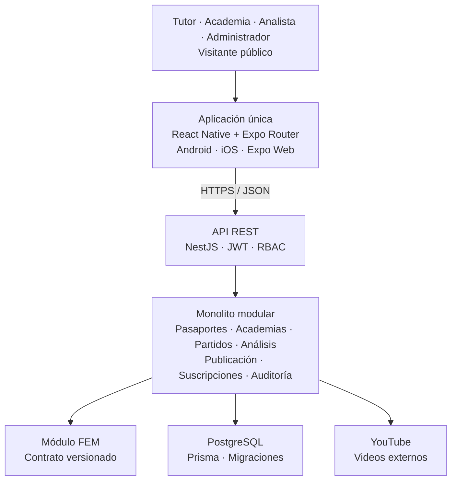

# Arquitectura inicial para el MVP

- **Producto:** New Talents
- **Documento:** Documento de arquitectura
- **Versión:** 0.1
- **Estado:** Dirección arquitectónica aprobada para iniciar especificación técnica
- **Arquitectura base:** TocoYVoy
- **Fecha:** Septiembre de 2026

> **Decisión principal:** New Talents reutilizará la arquitectura de TocoYVoy: monorepo, aplicación React Native con Expo Router, backend NestJS, Prisma, PostgreSQL y autenticación JWT. La aplicación móvil será la superficie principal y la misma base Expo podrá publicar las rutas web requeridas para perfiles públicos y búsqueda.

## 1. Propósito y alcance

Este documento define la dirección arquitectónica inicial de New Talents a partir de la especificación funcional del MVP. Establece los componentes, límites de módulos, responsabilidades, contratos y decisiones técnicas necesarias para iniciar el proyecto.

No reemplaza las especificaciones por capacidad ni fija proveedores de infraestructura, fórmulas del Football Evaluation Model (FEM), precios, diseño visual o detalles de implementación que deban decidirse durante SpecKit.

## 2. Principios arquitectónicos

- Reutilizar la estructura y los patrones ya adoptados en TocoYVoy para reducir riesgo y mantener consistencia entre proyectos.
- Comenzar con un monolito modular y una sola base de datos transaccional.
- Construir una única aplicación Expo para Android e iOS, con salida web para las rutas públicas necesarias.
- Mantener el pasaporte del jugador como agregado central y permanente.
- Separar el motor FEM mediante un contrato versionado, sin convertirlo inicialmente en un microservicio.
- Tratar eventos, evaluaciones, publicaciones, pagos y cambios de responsable como información auditable.
- Evitar dependencias innecesarias de almacenamiento audiovisual: la plataforma administra enlaces y metadatos, no los archivos de video.

## 3. Decisiones arquitectónicas aprobadas

| **ID** | **Decisión**                                                              | **Estado** |
|--------|---------------------------------------------------------------------------|------------|
| DA-01  | Monorepo con aplicaciones separadas para frontend y backend.              | Aprobada   |
| DA-02  | React Native + Expo Router para una única aplicación móvil.               | Aprobada   |
| DA-03  | Expo Web para perfiles públicos y búsqueda sin un segundo frontend.       | Aprobada   |
| DA-04  | Backend NestJS como monolito modular con API REST.                        | Aprobada   |
| DA-05  | PostgreSQL con Prisma ORM y migraciones versionadas.                      | Aprobada   |
| DA-06  | JWT, roles y autorización por recurso.                                    | Aprobada   |
| DA-07  | Videos en YouTube; solo enlaces y metadatos en New Talents.               | Aprobada   |
| DA-08  | FEM como módulo desacoplado mediante interfaces y resultados versionados. | Aprobada   |
| DA-09  | Pagos confirmados manualmente en el MVP.                                  | Aprobada   |

## 4. Vista general

*Figura 1. Vista de contenedores y dependencias principales.*

### 4.1 Aplicación Expo

La aplicación React Native será el único cliente del MVP. Expo Router administrará navegación, rutas protegidas, deep links y distribución por plataforma. Android e iOS serán los destinos principales; Expo Web expondrá las rutas públicas de jugadores y las funciones de búsqueda que deban abrirse desde un navegador.

- Una sola base de código para tutor, academia, analista y administrador.
- Menús, pantallas y acciones condicionados por rol y relación con el recurso.
- Rutas públicas separadas de las rutas autenticadas.
- La aplicación no reproducirá el video dentro del flujo del analista; abrirá el enlace externo cuando corresponda.

### 4.2 Backend NestJS

El backend será una API REST construida con NestJS. Los módulos de negocio compartirán proceso y base de datos, pero mantendrán límites explícitos, servicios propios y dependencias controladas. Los controladores validan y exponen casos de uso; los servicios aplican reglas; Prisma gestiona persistencia y transacciones.

### 4.3 Persistencia

PostgreSQL será la fuente autoritativa de cuentas, pasaportes, relaciones, partidos, eventos, análisis, publicaciones, pagos y auditoría. Prisma definirá el esquema, las restricciones y las migraciones. Los invariantes críticos deberán reforzarse tanto en dominio como en base de datos.

## 5. Organización del repositorio

| **Ruta**      | **Responsabilidad**                                                                   |
|---------------|---------------------------------------------------------------------------------------|
| apps/backend  | API NestJS, módulos de negocio, Prisma, migraciones y pruebas del backend.            |
| apps/frontend | Aplicación React Native con Expo Router para Android, iOS y Expo Web.                 |
| docs          | Especificación funcional, arquitectura, ADR, contratos y documentación operativa.     |
| docker        | Recursos de desarrollo local y servicios auxiliares, siguiendo el patrón de TocoYVoy. |
| specs         | Especificaciones, planes y tareas generadas mediante SpecKit.                         |

> **Regla:** No se crean repositorios separados ni microservicios para el FEM, la publicación o los pagos durante el MVP.

## 6. Módulos del backend

| **Módulo**    | **Responsabilidad**                                                             | **Dependencias permitidas**               |
|---------------|---------------------------------------------------------------------------------|-------------------------------------------|
| Auth          | Inicio de sesión, emisión y renovación de credenciales, recuperación de acceso. | Users                                     |
| Users         | Cuentas, roles, contactos y usuarios internos de academias.                     | Audit                                     |
| Players       | Identidad interna del jugador y datos futbolísticos.                            | Audit                                     |
| Passports     | Ciclo de vida, responsable activo, visibilidad y estado del servicio.           | Players, Users, Academies, Billing, Audit |
| Academies     | Academias, usuarios, adscripciones, traslados e historial.                      | Users, Players, Audit                     |
| Matches       | Registro de partidos y estados operativos.                                      | Players, Passports, Audit                 |
| Media         | Enlaces de YouTube y metadatos de mejores momentos.                             | Matches, Analysis                         |
| Analysis      | Eventos, contexto, complejidad, consecuencia y flujo de análisis.               | Matches, Users, Evaluation, Audit         |
| Evaluation    | Contrato FEM, cálculo y almacenamiento de resultados versionados.               | Analysis                                  |
| Publication   | Publicación de análisis, perfiles públicos, búsqueda y correcciones.            | Passports, Analysis, Evaluation, Media    |
| Billing       | Planes, suscripciones, pagos manuales, vencimiento y suspensión.                | Users, Academies, Passports, Audit        |
| Notifications | Creación y entrega de avisos funcionales.                                       | Users y eventos de aplicación             |
| Audit         | Registro inmutable de acciones relevantes y cambios de estado.                  | Sin dependencia de negocio                |

## 7. Límites y reglas de dominio

**ARQ-RN-01 — Pasaporte único.** El pasaporte es permanente y no se recrea al cambiar de tutor o academia.

**ARQ-RN-02 — Una academia activa.** La base de datos debe impedir más de una adscripción activa por jugador.

**ARQ-RN-03 — Responsable activo.** Las operaciones de tutor o academia dependen del responsable vigente, no solo del rol global.

**ARQ-RN-04 — Publicación separada.** Un análisis puede estar finalizado internamente sin estar visible; la publicación es una transición explícita.

**ARQ-RN-05 — Suspensión conservativa.** Suspender oculta el perfil y bloquea nuevos análisis, pero nunca elimina historial.

**ARQ-RN-06 — Resultados versionados.** Cada evaluación conserva la versión del modelo FEM y sus resultados históricos.

**ARQ-RN-07 — Auditoría.** Aprobaciones, traslados, publicaciones, correcciones, activaciones, suspensiones y pagos deben registrar actor y fecha.

## 8. Modelo de datos conceptual

| **Entidad**         | **Propósito**                                                      | **Relaciones principales**                  |
|---------------------|--------------------------------------------------------------------|---------------------------------------------|
| User                | Cuenta autenticable de tutor, academia o personal New Talents.     | Guardian, AcademyMembership, AuditEntry     |
| Player              | Identidad interna y datos deportivos del jugador.                  | Passport, Match, AcademyAffiliation         |
| Passport            | Estado, responsable, visibilidad y trayectoria consolidada.        | Player, Subscription, Publication           |
| Guardian            | Relación entre tutor y uno o varios jugadores.                     | User, Player                                |
| Academy             | Organización responsable temporal de varios jugadores.             | AcademyMembership, AcademyAffiliation, Plan |
| AcademyAffiliation  | Adscripción histórica del jugador a una academia.                  | Player, Academy, TransferRequest            |
| Match               | Contexto del partido registrado para un jugador.                   | Player, Analysis, VideoLink                 |
| Event               | Acción observable con minuto, resultado y datos de interpretación. | Analysis, Evidence                          |
| Analysis            | Trabajo interno y estado de publicación de un partido.             | Match, Event, EvaluationSnapshot            |
| EvaluationSnapshot  | Resultado inmutable de una versión del FEM.                        | Analysis, EvaluationModelVersion            |
| Highlight           | Evento elegido como mejor momento visible.                         | Event, Match, VideoLink                     |
| Subscription / Plan | Vigencia comercial individual o por academia.                      | Passport o Academy, Payment                 |
| AuditEntry          | Actor, acción, recurso, fecha y cambios relevantes.                | User y recurso auditado                     |

## 9. Motor FEM desacoplado

El FEM se implementará inicialmente como un módulo interno de NestJS. Su desacoplamiento se logra mediante interfaces, objetos de entrada y salida estables y versionamiento; no mediante infraestructura distribuida.

### 9.1 Contrato de entrada

- Jugador y partido analizado.
- Eventos observables con resultado y minuto.
- Contexto, complejidad, consecuencia y evidencia disponibles.
- Versión del catálogo y del modelo solicitada.

### 9.2 Contrato de salida

- Resumen estadístico del partido.
- Indicadores, capacidades y competencias calculadas.
- Datos preparados para evolución y comparación.
- Versión del modelo, fecha de cálculo y trazabilidad de evidencias.

> **Restricción:** Las fórmulas, pesos, rating y métricas físicas no forman parte de esta decisión arquitectónica. El contrato debe permitir incorporarlos posteriormente sin modificar los módulos de pasaportes, partidos o publicación.

## 10. API y contratos

- API REST sobre HTTPS con JSON.
- DTO de entrada validados y rechazo de campos no permitidos siguiendo el patrón de TocoYVoy.
- Respuestas y errores con contrato consistente, códigos funcionales y mensajes seguros.
- Paginación para listados de jugadores, partidos, eventos y auditoría.
- Endpoints públicos separados de endpoints autenticados.
- Operaciones sensibles protegidas mediante rol, estado del recurso y relación activa con el jugador.
- Actualizaciones críticas dentro de transacciones de base de datos.

## 11. Autenticación y autorización

| **Control**              | **Aplicación**                                                                      |
|--------------------------|-------------------------------------------------------------------------------------|
| JWT                      | Autenticación de tutor, academia, analista y administrador.                         |
| Roles                    | Delimitan capacidades generales: TUTOR, ACADEMY, ANALYST y ADMIN.                   |
| Autorización por recurso | Verifica responsabilidad vigente, pertenencia a academia y acceso al jugador.       |
| Rutas públicas           | Permiten consultar únicamente perfiles activos, autorizados y no sensibles.         |
| Datos sensibles          | Nunca se exponen en respuestas públicas ni en índices de búsqueda.                  |
| Auditoría                | Registra operaciones administrativas y cambios sobre menores, evaluaciones y pagos. |

## 12. Integraciones externas

### 12.1 YouTube

New Talents almacenará la URL, identificador externo, estado y metadatos mínimos del video. El MVP no descargará, recodificará ni almacenará videos. Los mejores momentos se ubicarán mediante el minuto del partido y no requerirán clips independientes.

### 12.2 Pagos

Los pagos se registrarán manualmente por New Talents. Billing deberá exponer una interfaz de confirmación independiente de la fuente para permitir una futura pasarela sin modificar Passports ni Academies.

### 12.3 Notificaciones

El dominio generará notificaciones internas a partir de cambios de estado. El canal concreto se mantendrá abstraído para admitir inicialmente avisos dentro de la aplicación y añadir posteriormente correo o mensajería.

## 13. Despliegue y ambientes

| **Ambiente** | **Propósito**                                                            |
|--------------|--------------------------------------------------------------------------|
| Local        | Desarrollo mediante monorepo y servicios Docker, con PostgreSQL aislado. |
| Test         | Ejecución automatizada de pruebas unitarias, integración y contratos.    |
| Staging      | Validación funcional del flujo completo antes de producción.             |
| Producción   | API, PostgreSQL administrado y builds móviles/web de Expo.               |

> **Pendiente:** El proveedor cloud, estrategia de CI/CD, EAS Build, dominio, monitoreo y respaldos se decidirán al crear el plan técnico. No bloquean la arquitectura lógica.

## 14. Calidad y pruebas

- Pruebas unitarias para reglas de dominio y servicios.
- Pruebas de integración con PostgreSQL real para restricciones, transacciones y concurrencia.
- Pruebas de API para autenticación, roles, propiedad del recurso y contratos de error.
- Pruebas end-to-end de los cortes verticales principales.
- Pruebas del FEM por versión con conjuntos de eventos conocidos y resultados reproducibles.
- Pruebas de privacidad que demuestren que los endpoints públicos no exponen datos sensibles.

## 15. Orden de implementación

| **Corte**               | **Capacidades**                                                                       | **Resultado verificable**                                              |
|-------------------------|---------------------------------------------------------------------------------------|------------------------------------------------------------------------|
| 1\. Base y pasaporte    | Monorepo, autenticación, roles, cuentas, jugador, solicitud, aprobación y activación. | Tutor o academia crea una solicitud y New Talents activa el pasaporte. |
| 2\. Academias           | Usuarios de academia, adscripción, traslado, retorno al tutor e historial.            | El pasaporte cambia de responsable sin duplicarse.                     |
| 3\. Partido y análisis  | Partidos, eventos, contexto, complejidad, consecuencia y estados internos.            | El analista registra manualmente un partido completo.                  |
| 4\. FEM y publicación   | Contrato FEM, resultados versionados, observaciones, highlights y enlace de YouTube.  | New Talents publica un análisis visible.                               |
| 5\. Trayectoria pública | Evolución, comparación, perfil público, búsqueda y protección de datos.               | Un visitante consulta un jugador activo sin ver datos sensibles.       |
| 6\. Operación comercial | Planes, suscripciones, pagos manuales, suspensión, reactivación y notificaciones.     | El estado comercial controla la visibilidad sin perder historial.      |

## 16. Decisiones pendientes

| **Tema**        | **Decisión requerida**                                                             | **Momento**          |
|-----------------|------------------------------------------------------------------------------------|----------------------|
| Infraestructura | Proveedor cloud, base de datos administrada, almacenamiento de secretos y backups. | Plan técnico         |
| Expo Web        | Modo de despliegue, dominio y estrategia de indexación de perfiles públicos.       | Antes del corte 5    |
| Notificaciones  | Canales iniciales y proveedor externo si aplica.                                   | Antes del corte 6    |
| FEM             | Catálogos, fórmulas, escalas y política de recalcular resultados históricos.       | Durante cortes 3 y 4 |
| Pagos           | Periodicidad, límites de planes y futura pasarela.                                 | Antes del corte 6    |
